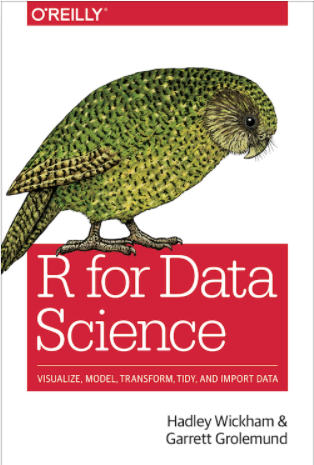
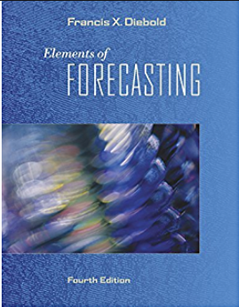

---
aliases:
- library
author:
  name: Francisco Piccolo
title: Livros que Li e Recomendo
date: 2020-12-06
---

## 2021

|{ width=50% }|{ width=50% }|{ width=50% }|
|:---:|:---:|:---:|

  
  
  

  
  
  

